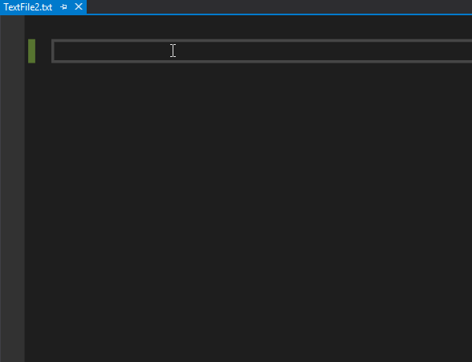

# VSCodeLensOpenSource
Contains code for creating own code lens in Visual Studio 2017.

There's an example included which adds code lens for all lines which contain the word `TODO`.
Just use an experimental instance to play around with it :)

Small gif to show what you'll get.

](CodeLensMinimal.gif)
